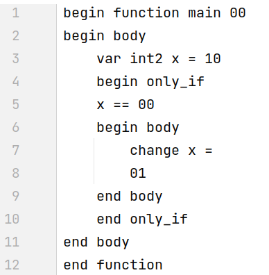
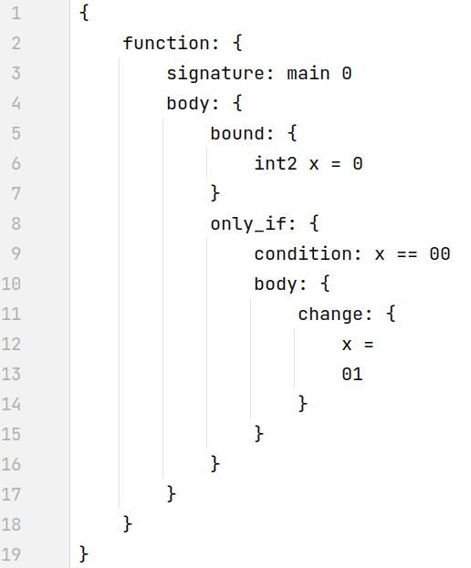

# Парсер конкретного синтаксиса

Проект заключался в разработке конкретного синтаксиса языка по заданному абстрактному синтаксису (подробности в [ConcreteSyntax.md](tasks/ConcreteSyntax.md)) и реализации для него синтаксического анализатора (подробности в [Parser.md](tasks/Parser.md))

Мой проект: язык [L](lang/L.md) + особенность синтаксиса 3 (Soft keywords)

# Пример работы программы

Имеем исходный файл с кодом, соответствующим разработанному конкретному синтаксису

В качестве результата работы парсера и синтаксического анализатора получаем абстрактное синтаксическое дерево

# Запуск

   * Тесты находятся в папке [parser/tests/](parser/tests/). Сам парсер собран в бинарник `parser/parser`. Он принимает на вход один параметр — путь до файла где находится тест. Скрипт [parser/run.sh](parser/run.sh) запускает все тесты. Для добавления тестов достаточно написать тест в файл и добавить его в папку tests/ с расширением `.in`

# Результат

В качестве результата сделана [презентация](https://docs.google.com/presentation/d/1_xMy53HWEKPJ2RjHdZdF30-LSLk0g5KG1ioNPfFz7lk/edit?usp=sharing), в которой описано:

* В чем состояла задача
* Как я ее решал: какой и почему выбрал синтаксис, как парсил
* Какие сложности возникли и как я их преодолел
* Что конкретно я сделал
