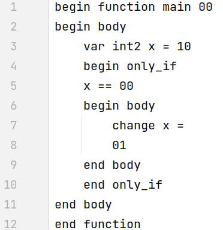
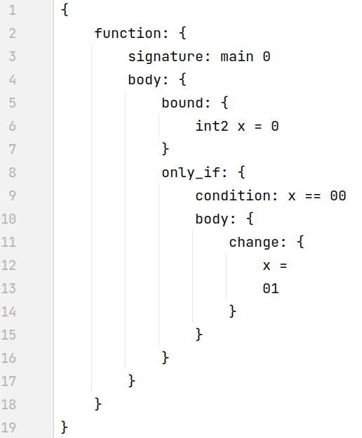
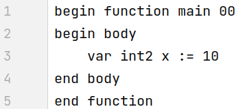
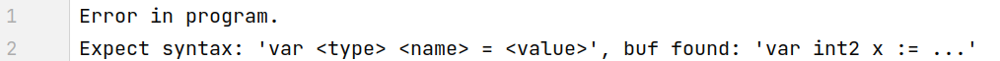

# Concrete syntax parser

The project consisted in the development of a specific language syntax according to a given abstract syntax (details in [ConcreteSyntax.md](tasks/ConcreteSyntax.md)) and the implementation of a parser for it (details in [Parser.md](tasks/Parser.md))

My project: language [L](lang/L.md) + syntax feature 3 (Soft keywords)

# Example programs work

We have a source file with code corresponding to the developed specific [syntax](syntax.txt)

As a result of the work of the parser and the parser, we get an abstract syntax tree

If the source file with the code does not match the [syntax](syntax.txt)

Then, as a result of the work of the parser and the parser, we get a meaningful error message

# Launch

   * The tests are located in the [parser/tests/](parser/tests/) folder. The parser itself is compiled into the `parser/parser` binary. It takes one parameter as input - the path to the file where the test is located. The script [parser/run.sh](parser/run.sh) runs all tests. To add tests, just write a test to a file and add it to the tests/ folder with the `.in` extension

# Results

As a result, a [presentation] was made (https://docs.google.com/presentation/d/1_xMy53HWEKPJ2RjHdZdF30-LSLk0g5KG1ioNPfFz7lk/edit?usp=sharing), which describes:

* What was the task
* How I solved it: what and why I chose the syntax, how I parsed
* What difficulties arose and how I overcame them
* What exactly did I do
